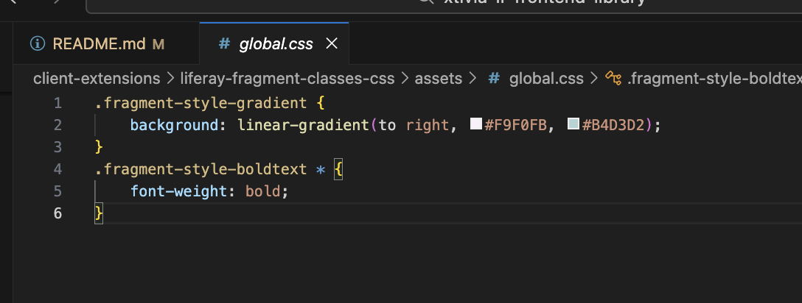
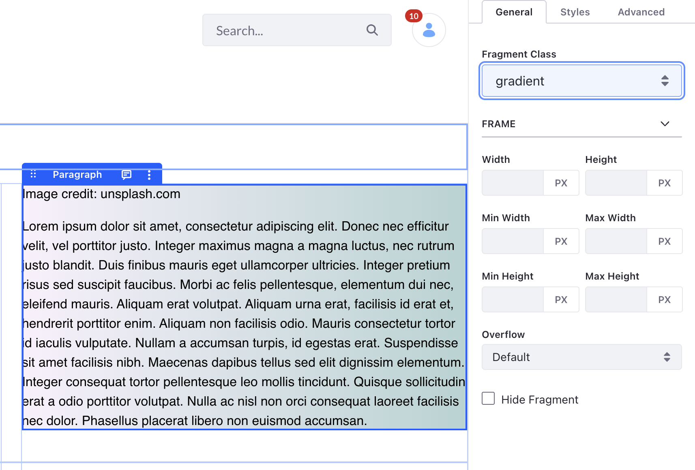
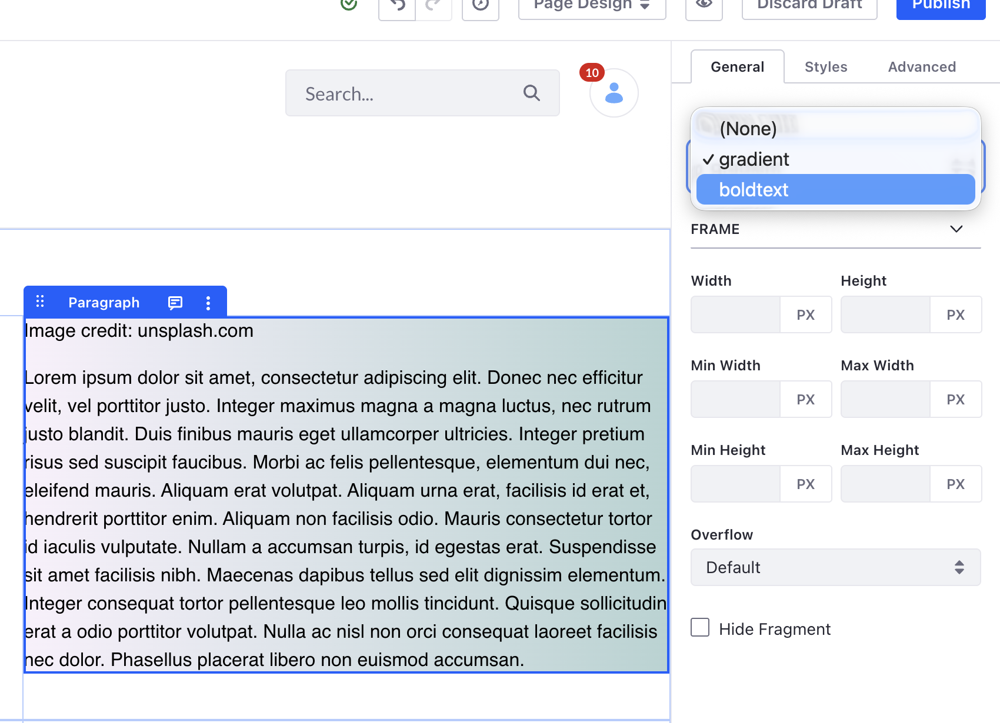

# Liferay Custom Fields Sample

Easy to access, enumerated classes for fragments.

## Getting Started

This is meant to be imported into a client extension. Since this is the first app using the framework, it's already included as an example.

- If you don't have the custom fields client extension yet, here's how to get it:
  - In a terminal, navigate to your Liferay workspace's _client-extensions_ folder
  - Clone the client extension into your folder using `git clone git@github.com:lbeharxtivia/liferay-editor-custom-fields-client-extension.git`
  - Run `blade gw clean deploy` to deploy your new client extension
- Go to your custom fields client extension folder in terminal
- Install the fragment-classes module `yarn add @liferay-editor-custom-fields/fragment-classes^74.0.0`
- Import and call the init function in src/index.ts

```
import initFragmentClasses from '@liferay-editor-custom-fields/fragment-classes';

initFragmentClasses();
```


## How to use
- Create a css rules for a class beginning in `fragment-style-` anywhere on the site, whether in the theme a css client extension, or somewhere else.
- In the page editor, choose the fragment you want to style.
- The client extension will insert a "Fragment Style Class" dropdown to the top of your General tab, add then populate it with a list of classes beginning in `fragment-style-` defined in CSS rules.
- Choose the class you want to style the fragment with. The styles will be applied automatically.








## License

MIT Licensed. Copyright (c) Xtivia 2026.
